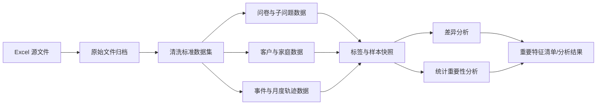

# NPS 满意度数据与特征分析设计文档

## 1. 文档目标

本设计以 `指标汇总.xlsx` 为当前数据源，建设可复用的 NPS 满意度分析数据集，支持：

1. 以问卷为粒度构建客群评分数据集、题目字典、子问题映射及客户声音数据集。
2. 对基础、家庭、业务、投诉、资费、流量和触点数据进行标准化、去重和关联。
3. 构建客户家庭关系，以及调研时点之前 6 个月的静态和时序特征。
4. 比较低分、非低分与全量客群的分布和特征差异，识别稳定、可解释的重要特征。
5. 输出清洗后的数据文件、客群分析结果、时间轨迹结果和重要特征清单。

本文范围止于数据整理、清洗、客群分布、特征差异、时间轨迹和重要特征结果输出。

本文中的“高分客群”按已确认业务口径表示“非低分客群”，并不等同于标准 NPS 的推荐者。数据文件及代码字段统一使用 `non_low`，展示层可显示为“高分（非低分）”。

## 2. 已确认口径与数据基线

### 2.1 已确认口径

| 项目 | 口径 |
| --- | --- |
| 分析粒度 | 一张问卷，即一个调研流水号 |
| 低分 | Q1-Q5、Q98、N1 中任一有效评分为 1-6 |
| 非低分 | 至少有一个有效评分，且所有有效评分均为 7-10 |
| 无法分群 | 所有评分均缺失或非法；进入隔离数据集，不参与客群对比 |
| 时间窗口 | 调研月份之前 6 个完整自然月，即 `[-6, -1]` |
| 家庭关联 | 优先使用共享宽带号码，结合主付费人字段确定角色 |
| 子问题 | `QX-X` 的正数值表示命中相应选项，不是满意度分数 |
| 客户声音 | 保留 Q99 有效文本，剔除空值、`\N`、`-1` 等哨兵值 |

标签伪代码：

```sql
case
  when valid_score_count = 0 then 'unlabeled'
  when low_score_count > 0 then 'low'
  else 'non_low'
end
```

有效评分必须为可转换成整数的 1-10，0 作为越界异常值隔离。第 7 列“营销宣传满意度”的 0/100 指标不是 Q 题原始评分，不参与上述标签计算。

### 2.2 当前文件基线

工作簿包含 11 张表。

| 工作表 | 工作表总行数 | 主要用途 |
| --- | ---: | --- |
| 测评明细 | 6,417 | 问卷、评分、子问题、Q99、场景 |
| 基础指标 | 13,821 | 客户静态画像 |
| 家庭指标 | 12,167 | 手机号与宽带、家庭角色 |
| 近半年指标 | 86,703 | 月度使用、费用、资源和状态 |
| 业务订购 | 123,153 | 订购及到期事件 |
| 投诉明细 | 4,997 | 投诉事件及文本 |
| 资费变更 | 5,253 | 升档、降档、平移事件 |
| 限速与加包 | 10,512 | 限速及加速包事件 |
| 狼号 | 4,880 | 特定接触事件 |
| 触点轨迹 | 90,068 | 渠道触点、情绪、问题和文本 |
| AI感知总结 | 6,149 | 感知总结和短板 |

注意：上述是包含表头的物理行数，不是最终有效记录数。`测评明细` 第 1 行为分组标题、第 2 行为字段名、数据从第 3 行开始；其余表存在中文字段名和英文技术字段名两层表头的情况，数据抽取时应按配置跳过并校验，不能依赖人工删除。

当前问卷基线：

| 指标 | 数值 |
| --- | ---: |
| 有效物理问卷行 | 6,415 |
| 唯一客户 | 6,208 |
| 重复参评客户 | 202 |
| 唯一调研流水号 | 6,415 |
| 重复调研流水号 | 0 |
| 低分问卷 | 832（12.97%） |
| 非低分问卷 | 5,583（87.03%） |
| 无有效评分问卷 | 0 |

家庭覆盖基线：6,208 个参评客户中，4,285 个可在家庭指标中找到，占 69.02%；家庭指标包含 4,645 个宽带号码，其中 3,164 个关联多个手机号，单宽带最多关联 7 个手机号。

近半年指标当前覆盖月份为 202602-202608。清洗时仍需逐表执行时间范围、未来日期和异常日期校验。

## 3. 文件型数据架构

分析成果默认交付为 CSV 文件，无需数据库。处理流程分为原始文件、清洗数据集和分析数据集三层：



- 原始文件归档：原样保存工作簿，并记录工作表、源行号、处理批次、文件哈希和抽取时间，不覆盖历史。
- 清洗标准数据集：统一类型、空值、标识、日期和业务键，按主题输出规范化 CSV。
- 分析数据集：以问卷调研时点为锚点，输出标签、客户快照、家庭快照、6 个月轨迹及分析特征 CSV。
- 数据量较大时可同步输出同名 Parquet 文件以提升读取速度，但 CSV 是基础交付物，二者内容和字段口径必须一致。

### 3.1 文件目录建议

```text
data/
  raw/{batch_id}/指标汇总.xlsx
  clean/{batch_id}/*.csv
  analysis/{version}/*.csv
  dictionary/*.csv
  quality/{batch_id}/*.csv
  manifest/{batch_id}.json
```

### 3.2 CSV 交付规范

- 文件名使用下文逻辑数据集名称，例如 `fact_survey.csv`；一个文件只包含一种固定粒度的数据。
- 编码使用 UTF-8 with BOM，分隔符为英文逗号，文本按标准 CSV 转义，确保 Python、R 和 Excel 均可读取。
- 首行为稳定的英文技术字段名；中文名称、类型、含义和枚举值维护在独立字段字典 CSV 中。
- 缺失值输出为空字段，不在清洗结果中继续使用 `\N`、`-1` 等源系统哨兵值；字段语义要求保留的 `-1` 除外。
- 日期统一为 `YYYY-MM-DD`，时间统一为 `YYYY-MM-DD HH:mm:ss`，月份统一为 `YYYY-MM-01`。
- 所有标识字段强制按字符串写出，防止号码、流水号被科学计数法转换或丢失前导零。
- 每批生成 manifest，记录文件名、行数、字段数、文件哈希、数据版本、生成时间和源文件哈希。
- 若单个 CSV 过大，可按 `survey_month` 或 `event_month` 拆分文件，并在 manifest 中列出全部分片。

## 4. 核心数据集设计

### 4.1 问卷主数据集 `fact_survey.csv`

一行一张问卷。

| 字段 | 说明 |
| --- | --- |
| `survey_id` | 调研流水号，问卷唯一业务标识 |
| `customer_key` | 手机号码规范化后生成的不可逆标识 |
| `survey_month` | 调研月份，转为月初日期 |
| `survey_scene` | 调研业务场景 |
| `city/district/service_center` | 调研时组织归属 |
| `is_fttr/is_bandwidth_ge_500m/is_traffic_customer` | 问卷附属标识 |
| `valid_score_count` | 有效评分题数 |
| `low_score_count` | 1-6 评分题数 |
| `segment_label` | `low/non_low/unlabeled` |
| `source_row_no/source_batch_id` | 追溯字段 |

`survey_id` 在文件内必须唯一。`(customer_key, survey_month, survey_scene)` 不作为去重键，因为同一客户同月同场景可能存在合法重复调研。

### 4.2 评分长数据集 `fact_survey_score.csv`

将 Q1-Q5、Q98、N1 从宽表转成长表，一行一张问卷的一道评分题。

| 字段 | 说明 |
| --- | --- |
| `survey_id` | 问卷关联键 |
| `customer_key` | 客户标识 |
| `question_code` | `Q1`、`Q2`、`Q3`、`Q4`、`Q5`、`Q98`、`N1` |
| `raw_value` | 原始值，供审计 |
| `score_value` | 清洗后的 1-10 整数 |
| `is_valid` | 是否有效评分 |
| `is_low_score` | 有效且为 1-6 |
| `invalid_reason` | 缺失、哨兵值、越界或格式错误 |

`(survey_id, question_code)` 在文件内必须唯一。任何题目级分析以该数据集为准；客户总标签以同一 `survey_id` 下全部有效评分聚合。

### 4.3 题目和子问题字典

`dim_question.csv` 保存题目版本、完整题干、主题、有效期和是否计入总标签。

`dim_subquestion_option.csv` 保存：

- `parent_question_code`：例如 `Q1`。
- `subquestion_code`：例如 `Q1-1`。
- `option_code`：例如 `1`。
- `option_text`：例如“夸大宣传，内容与实际不符”。
- `is_other_option`、`has_free_text`、`valid_from/to`。

当前映射应至少覆盖：Q1-1 的 7 个选项、Q2-1 的 5 个选项、Q3-1 的 5 个选项、Q4-1 的 8 个选项、Q5-1 的 6 个选项、Q98-1 的 6 个选项，以及各题“其他”填写内容。

### 4.4 子问题命中数据集 `bridge_survey_subquestion_hit.csv`

一行表示一张问卷命中一个子问题选项，一张问卷可有多行。

| 字段 | 说明 |
| --- | --- |
| `survey_id` | 问卷关联键 |
| `customer_key` | 客户标识，用于用户维度汇总 |
| `question_code` | 父评分题 |
| `subquestion_code` | 子问题代码 |
| `option_code` | 命中选项代码 |
| `option_text` | 通过字典关联，不从值本身推断 |
| `hit_flag` | 固定为 1 |
| `raw_value` | 原始单元格值 |

转换规则：正整数且等于该列定义的选项编号时生成命中记录；`-1` 为明确未命中；`\N`/空值为不适用或未作答。异常正数、文本或与列选项编号不一致的值进入质量隔离表。

子问题是低分后的追问题，属于结果解释信息。它用于低分原因占比和根因分析，不与调研前客户特征混在同一类重要性结果中。

### 4.5 客户声音数据集 `fact_customer_voice.csv`

保存 Q99 及其他允许进入文本分析的客户原声：

- `voice_id`、`survey_id`、`customer_key`、`voice_type`、`voice_text_raw`。
- 清洗后字段包括 `voice_text_clean`、语言、长度、是否有效、敏感信息处理状态。
- `-1`、`\N`、空白、纯标点和模板化无意义回答置为无效，但原始值保留在原始文件归档中。
- 文本主题、情绪和关键词作为客户声音分析结果单独产出，并区分调研前文本与当前问卷文本。

### 4.6 客户、家庭与成员关系

`dim_customer.csv` 保存脱敏客户标识及随时间变化的客户属性。源文件中的手机号和宽带号已经脱敏，分析数据集直接使用其规范化值作为 `customer_key` 和 `household_key`，不再二次散列或加盐。

`dim_household.csv`：

- `household_key`：规范化后的源脱敏宽带号。
- `broadband_key`、带宽、小区、开户日期、资费和有效期。

`bridge_household_member.csv`：

- `household_key`、`customer_key`、`member_role`、`is_primary_payer`。
- `effective_start/end`、`relation_source`、`confidence_score`、`source_batch_id`。

家庭生成规则：同一有效宽带号码关联的手机号归为同一家庭；主付费人标为 `payer`，其余为 `member`。一个手机号同时关联多个宽带时允许多家庭成员关系，不能强行合并；宽带换号、拆机和过户按有效期维护。缺少关系有效期时，只可生成“批次时点快照”，不得假设历史全程有效。

## 5. 数据清洗与去重

### 5.1 通用标准化

1. 字符串执行 Unicode 规范化、去首尾空格、统一全半角；业务名称保留原值并维护标准映射。
2. `None`、空字符串、纯空格、`\N` 统一为空值，同时保留 `raw_value` 和 `null_reason`。
3. `-1` 必须按字段语义处理：评分列为非法/缺失，子问题列为未命中，资费变更标识中的 `-1` 则表示降档，不能全局替换。
4. 手机和宽带号码先转字符串，去空格及无意义小数后缀，执行格式校验，再生成脱敏键。
5. `YYYYMM` 转月初日期；`YYYYMMDD` 和日期时间按字段配置解析。解析失败不得默认成 1970 年。
6. 金额、流量、语音和带宽统一单位并保留单位字段；同名重复列通过技术字段名及列位置显式映射。
7. 枚举统一为标准代码，原始中文值另存。例如“是/否”映射为 `1/0`，未知值为 `NULL`。

### 5.2 去重策略

- 问卷：先按 `survey_id` 去重。完全相同记录保留一条；冲突记录按有效字段完整度、合法评分数、最新处理批次排序，并将淘汰记录写入审计数据集。
- 客户基础：按 `customer_key + snapshot_date/type` 去重；同一时点冲突按来源优先级和完整度决策。
- 月度指标：按 `customer_key + month + customer_type + broadband_key` 去重，禁止直接对整行 `distinct` 后认为问题已解决。
- 事件数据集：优先使用工单号、业务 ID 等源唯一标识；无源唯一标识时使用“客户 + 事件时间 + 事件类型 + 关键内容哈希”的复合键。
- 家庭关系：按 `household_key + customer_key + effective_start` 去重，相邻且属性一致的区间合并。
- 每次去重输出输入数、唯一数、完全重复数、冲突重复数、保留规则和样例审计 ID。

### 5.3 质量检查与异常隔离

生成 `dq_reject_record.csv`，记录源表、行号、字段、原始值、规则代码和批次。关键检查包括：

- 调研流水号非空且批次内唯一率为 100%。
- 评分清洗后只能为整数 1-10，0 及其他异常值全部可追溯。
- 子问题命中值必须与列定义的选项编号一致。
- 各数据集中的客户、问卷和题目关联键匹配率达到约定阈值。
- 事件时间不得晚于抽取时间；进入调研前特征分析的记录不得晚于调研截止时间。
- 行数、空值率、枚举分布、重复率和低分率相对上一批次突变时告警。

## 6. 调研时点分析样本

`survey_analysis_sample.csv` 一行一张问卷，所有特征都带 `as_of_date` 和 `feature_window`。

主窗口定义：若调研月份为 $T$，月度特征只使用 $T-6$ 至 $T-1$。调研当月信息默认不进入调研前特征分析，因为无法证明其发生在问卷之前；存在精确时间戳时，可单独生成 `t0` 当月分析数据。

分析字段按用途分开：

- Q1-Q5、Q98、N1 分数仅用于生成客群标签和题目分布。
- 子问题命中、Q99 文本和当前问卷的 AI 总结仅用于低分原因及客户声音分析。
- 客户特征差异分析只使用调研时点已有的基础、家庭和调研前 6 个月行为数据。
- 调研后发生的投诉、订购、资费变更和触点事件不进入当前问卷的特征差异分析。

同一客户的多次问卷均保留。总体客群分布按问卷粒度统计；涉及人数时按客户去重并单独标明。同一客户多次问卷和同一家庭多个成员可能造成观测相关性，显著性分析应使用按客户或家庭聚类的置信区间，并同时提供“保留全部问卷”和“每客户最近一次问卷”的敏感性结果。

## 7. 非时间特征差异与重要性分析

### 7.1 特征域

- 人口与地域：性别、年龄段、地市、区县、服务中心。
- 客户生命周期：入网时间、在网时长、客户类型、全球通等级。
- 终端：厂商、型号、终端类型。
- 套餐与资源：主套餐费用、带宽、套内流量、套内语音。
- 家庭：是否家庭、家庭人数、是否主付费人、家庭宽带数、家庭成员低分历史。
- 业务状态：FTTR、大带宽、流量运营客户、携入、携转查询、卡槽和省外驻留。

连续变量原则上保留连续值；分箱仅用于分布展示、WOE/IV 和稳定性分析，分箱边界在全量分析样本上确定并记录。高基数类别合并低频值并单独保留缺失类别。

### 7.2 三客群对比

每个特征同时输出全量、低分和非低分三组统计：

- 连续型：样本数、缺失率、均值、中位数、分位数、标准差和分布图。
- 类别型：各类别人数、占比、低分率、相对全量提升度和置信区间。
- 缺失本身作为候选特征，比较三组缺失率差异。

上述三类客群画像先输出为 `cohort_feature_profile_static.csv`，再基于相同的非时间特征集合生成重要性结果，保证画像与重要性分析口径一致。

差异检验和效应量：

- 连续型：KS 或 Mann-Whitney U，并报告标准化均值差或 Cliff's delta。
- 类别型：卡方检验；小样本使用 Fisher 精确检验，并报告 Cramer's V。
- 单变量区分能力：信息价值 IV、互信息和低分率提升度；不能只按 p 值排序。
- 多重比较使用 Benjamini-Hochberg 控制 FDR；设置最小样本数和最小类别占比。

显著性、效应量、覆盖率和跨时间稳定性必须同时达标，才可认定为重要特征。

### 7.3 重要特征综合评估

重要性结论基于多项统计证据综合形成。每个特征输出以下指标：

- 数据质量：有效样本数、覆盖率、缺失率、异常率和类别集中度。
- 差异程度：连续特征的标准化均值差或 Cliff's delta；类别特征的 Cramer's V。
- 区分能力：IV、互信息、各分组低分率及相对全量提升度。
- 稳定性：按调研月份、地市和业务场景分层后的方向一致率、效应量波动和 PSI。
- 冗余性：与其他特征的 Pearson/Spearman 相关系数、Cramer's V 或相关比。

先按 FDR 校正后的显著性和最小样本量排除证据不足的特征，再按效应量、区分能力、覆盖率和稳定性形成综合排序。权重应在分析结果中明确展示，并做不同权重下的排名敏感性检查。高度相关且含义相近的特征归为同一特征组，组内优先保留覆盖率高、口径清晰、稳定性好的代表特征。

## 8. 时间轨迹与时序重要性

### 8.1 统一轨迹数据

生成 `fact_customer_monthly_metric.csv`：

| 字段 | 说明 |
| --- | --- |
| `customer_key` | 客户标识 |
| `month` | 自然月 |
| `metric_code` | ARPU、流量、语音、超套费等 |
| `metric_value` | 标准单位数值 |
| `missing_reason` | 未观察、无业务、不适用或源缺失 |

生成 `fact_customer_event.csv`，统一承载订购、投诉、资费变更、限速加包、狼号和触点：`event_id/customer_key/event_time/event_type/event_subtype/channel/amount/direction/detail_ref`。

映射到问卷后增加 `month_offset = event_month - survey_month`，主分析仅保留 `-6` 至 `-1`。月度宽表必须补齐 6 个时间槽，区分“该月无事件”和“该月数据缺失”。

### 8.2 轨迹清洗

- 同月同指标先按明确业务规则聚合：存量取月末值，流量/语音/费用取月累计，事件取次数及金额。
- 极端值先做业务边界校验，再采用全量分析样本的分位数截尾；原始值保留，不盲目删除真实高值。
- 仅对适合的存量指标做前向填充，并设置最大填充跨度；事件次数缺失不能自动当作 0，除非源覆盖完整。
- 对重复的流量使用量、语音使用量等同名字段，通过技术字段名确认口径后分别重命名。
- 时间顺序异常、结束早于开始、调研后事件进入主窗口等记录进入质量隔离。

### 8.3 轨迹展示与派生特征

低分、非低分和全量客群按月偏移展示均值/中位数、置信带和样本覆盖率。禁止只画均值而隐藏缺失和样本变化。

每个连续轨迹可派生：

- 最近值、6 月均值/最大/最小/标准差。
- `last-first` 变化、线性趋势斜率、变异系数。
- 最近 1 月对前 5 月均值的偏离。
- 连续上涨/下降月数、异常跃迁次数、有效月份数。

每类事件可派生：近 1/3/6 月次数、距最近一次天数、渠道数、事件类型数、投诉升级次数、升降档净变化、限速和加包次数、负面情绪触点占比。

时序重要性采用三层统计比较：逐月偏移比较低分与非低分客群差异、比较轨迹摘要特征的效应量和区分能力、检验不同月份与场景下的方向稳定性。输出每个时间特征的显著性、效应量、最佳观察窗口、变化方向和稳定性。

## 9. 重要特征结果与分析产物

### 9.1 入选标准

一个重要特征至少满足：

1. 数据质量：覆盖率、异常率和口径可接受。
2. 差异性：效应量和 FDR 校正后显著性达标。
3. 区分能力：IV、互信息或低分率提升度达到分析阈值。
4. 稳定性：不同月份、地市、场景中的方向基本一致，PSI 不出现明显漂移。
5. 可解释性：业务含义清晰，能够说明与低分客群差异的方向和适用范围。

### 9.2 重要特征清单

| 结果文件 | 内容 | 用途 |
| --- | --- | --- |
| `important_feature_static.csv` | 基础、产品、家庭等非时间特征的重要性结果 | 客群差异解释 |
| `important_feature_trajectory.csv` | 使用、费用、资源及事件轨迹的重要性结果 | 时间变化解释 |
| `important_feature_group.csv` | 相关特征组、代表特征及组内关系 | 减少重复解释 |
| `root_cause_summary.csv` | 子问题命中、Q99 主题和客户声音摘要 | 低分原因分析 |

每份重要特征清单至少包含：特征名、中文含义、来源、分析粒度、时间窗口、有效样本数、覆盖率、低分/非低分统计量、p 值、FDR、效应量、IV/互信息、提升度、稳定性、方向、相关特征组、重要性等级和解释说明。

### 9.3 交付物

- 客群标签、评分长数据、题目/子问题字典、子问题命中和客户声音 CSV。
- 客户、家庭、家庭成员关系 CSV 及关联覆盖数据。
- 月度指标长数据、统一事件和问卷时点分析样本 CSV。
- 客群规模与占比、题目得分分布、地域/场景分布和子问题命中分布 CSV。
- 三客群特征差异、时间轨迹、重要特征和稳定性结果 CSV。
- 数据质量汇总、异常隔离记录和批次审计数据。

## 10. 数据解释边界

- “非低分”包含 7-8 分，与标准 NPS 推荐者 9-10 分不同。对外报告必须标注业务口径，建议同时保留标准三分类作为辅助维度。
- Q98、N1 在当前数据中有效回答较少，题目级结论必须展示有效样本数，不能与 Q5 直接比较占比。
- 家庭关系当前优先基于共享宽带号，若缺少历史有效期，只能代表抽取批次时点，不能直接回溯到任意调研月份。
- 手机号、语音转文本、投诉和 Q99 属于敏感数据。实行最小权限、脱敏、访问审计、传输/存储加密和文本导出审批。

## 11. 分析口径待确认项

以下信息会影响清洗或分析结果，执行数据分析前需形成明确口径：

1. 各工作表英文技术字段名与中文字段名的最终映射，尤其是重复的流量/语音字段。
2. 事件数据集的源业务唯一标识、各时间字段的业务含义及时区。
3. `类型/客户类型/场景` 等枚举的标准码表。
4. 家庭关系的有效期来源，以及宽带过户、拆分、融合家庭的判定规则。
5. 调研当月是否存在精确到日/时的问卷时间；在缺少精确时间时继续执行严格的前 6 个完整月窗口。
6. 特征显著性、最小样本量、效应量和稳定性分级阈值。